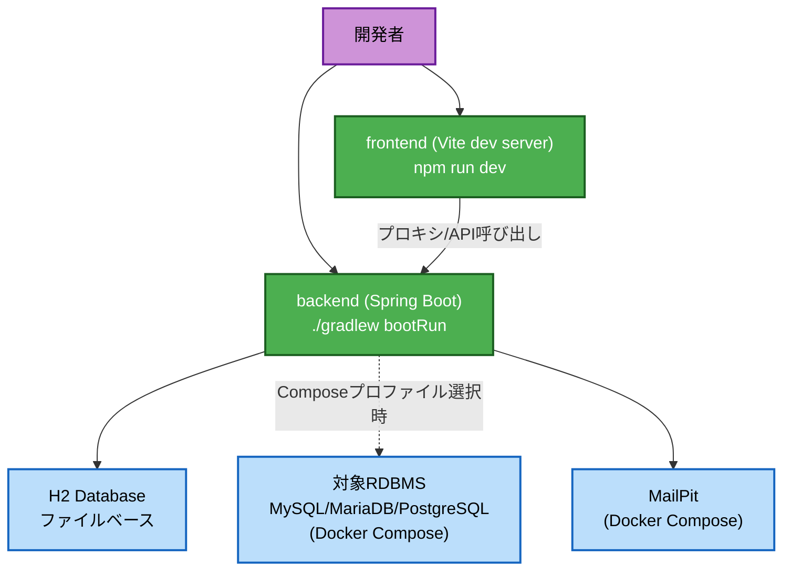
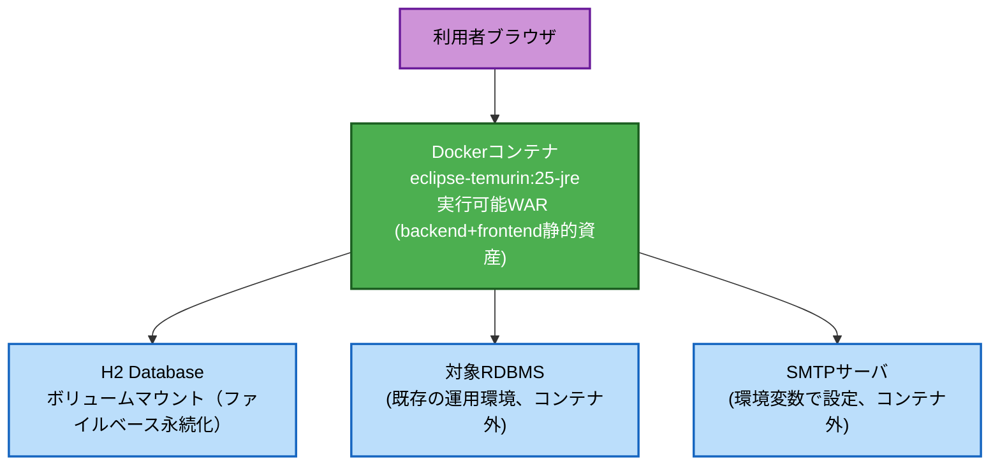

# Deployment Architecture — Unit 1: デザインシステム基盤

## 開発環境



### テキスト代替表現
```
開発者 → backend (Spring Boot, bootRun) → H2 Database (ファイルベース)
開発者 → backend                        → 対象RDBMS (Docker Compose、プロファイル選択時)
開発者 → backend                        → MailPit (Docker Compose)
開発者 → frontend (Vite dev server)      → backend (API呼び出し)
```

## 本番相当（単一コンテナ）



### テキスト代替表現
```
利用者ブラウザ → Dockerコンテナ (eclipse-temurin:25-jre、実行可能WAR)
Dockerコンテナ → H2 Database (ボリュームマウント、ファイルベース永続化)
Dockerコンテナ → 対象RDBMS (コンテナ外、環境変数で接続設定)
Dockerコンテナ → SMTPサーバ (コンテナ外、環境変数で接続設定)
```

**備考**: ロードバランサ・APIゲートウェイは単一インスタンス構成のため配置しない。将来的な
Tomcatへの実行可能WARデプロイにも対応するが、その場合もコンテナ構成と同様に単一インスタンス
かつ環境変数経由の設定を維持する。
