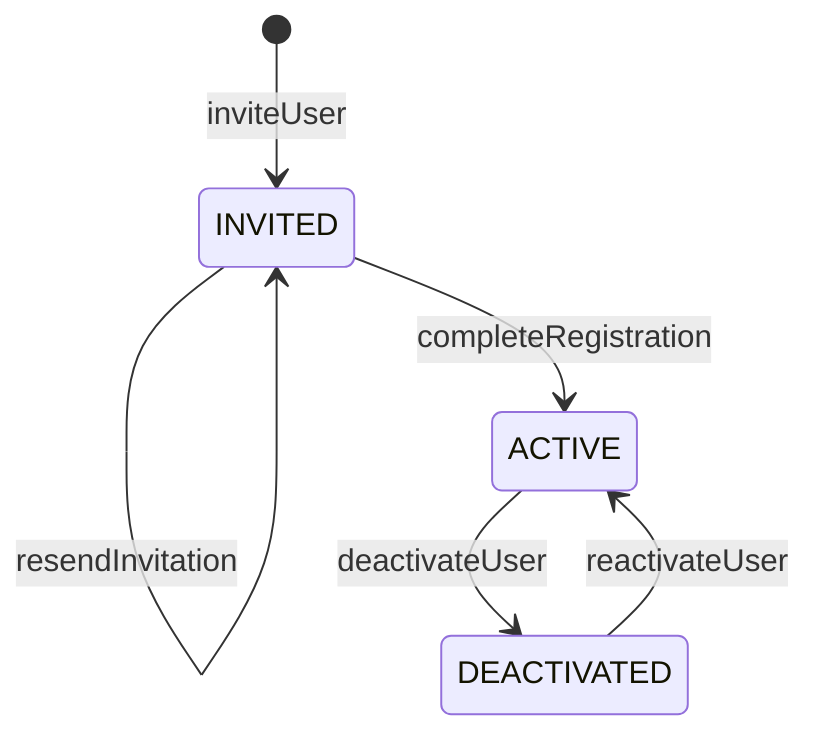
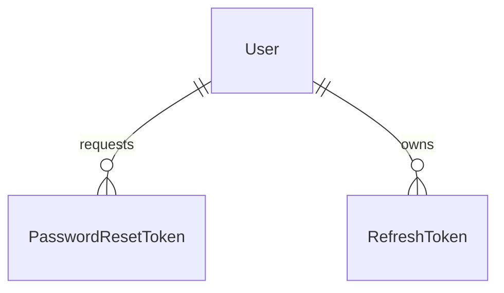

# Unit 2: ユーザ管理 - Domain Entities

技術非依存のドメインモデル。具体的な型・永続化方式（テーブル定義等）はCode Generationで確定する。

## 1. User（ユーザ）

Functional Design Plan Question 1（推奨A採用）により、招待済み・未完了ユーザと本登録完了
ユーザを単一エンティティで表現する。

| 属性 | 説明 |
|---|---|
| id | ユーザID（内部識別子） |
| email | メールアドレス（一意） |
| name | 氏名（表示名）。INVITED状態では未設定（null許容）、本登録完了時に必須設定される |
| role | ロール（ADMIN / GENERAL） |
| status | 状態（INVITED / ACTIVE / DEACTIVATED） |
| passwordHash | パスワードハッシュ（適応型ハッシュアルゴリズム）。INVITED状態では未設定 |
| invitationTokenHash | 招待トークンのハッシュ値（平文は保持しない） |
| invitationTokenExpiresAt | 招待トークンの有効期限 |
| invitedAt | 招待日時（再送時は更新される） |
| invitedBy | 招待した管理者のユーザID |
| registeredAt | 本登録完了日時 |
| failedLoginCount | 連続ログイン失敗回数 |
| lockedUntil | アカウントロック解除予定日時（null＝ロックなし） |
| createdAt / updatedAt | 監査用タイムスタンプ |

### 状態遷移



### 状態遷移（テキスト代替）

```
[初期状態] --inviteUser--> INVITED
INVITED --resendInvitation--> INVITED（トークン再発行、期限延長）
INVITED --completeRegistration（有効期限内）--> ACTIVE
ACTIVE --deactivateUser--> DEACTIVATED
DEACTIVATED --reactivateUser--> ACTIVE
```

初期管理者（`ensureInitialAdmin`）は招待フローを経ず、起動時に直接ACTIVE状態のUserレコードを
作成する（Question 7: 既に同一メールアドレスの管理者が存在する場合は何もしない）。

## 2. PasswordResetToken（パスワードリセットトークン）

招待トークンとは別エンティティとして管理する。ユーザは複数回リセット申請できるため、
申請ごとにレコードを発行し、新しい申請が発生した場合は同一ユーザの未使用トークンを
無効化する（悪用時の失効範囲を最小化するため）。

| 属性 | 説明 |
|---|---|
| id | トークンID |
| userId | 対象ユーザID |
| tokenHash | リセットトークンのハッシュ値（平文は保持しない） |
| expiresAt | 有効期限（デフォルト3時間。Question 4） |
| usedAt | 使用日時（null＝未使用） |
| createdAt | 発行日時 |

## 3. RefreshToken（リフレッシュトークン）

Question 6（推奨A採用）により、`familyId`でトークンファミリを識別する。

| 属性 | 説明 |
|---|---|
| id | トークンID |
| userId | 対象ユーザID |
| familyId | トークンファミリ識別子（ログイン成功時に発行、ローテーションでも引き継ぐ） |
| tokenHash | リフレッシュトークンのハッシュ値（平文は保持しない） |
| expiresAt | 有効期限（デフォルト24時間） |
| revokedAt | 失効日時（null＝有効）。ローテーション時の旧トークン失効、ログアウト時の即時失効、
  再利用検知時のファミリ一括失効のいずれかで設定される |
| createdAt | 発行日時 |

アクセストークン（JWT）自体は内部DBに永続化しない（ステートレス）。Question 3（推奨B採用）
により、ロールクレームをJWTに含める。

## エンティティ関連図



### 関連図（テキスト代替）

```
User (1) --- (0..*) PasswordResetToken
User (1) --- (0..*) RefreshToken
```
