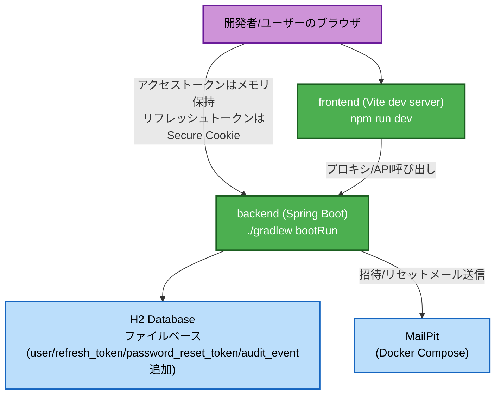
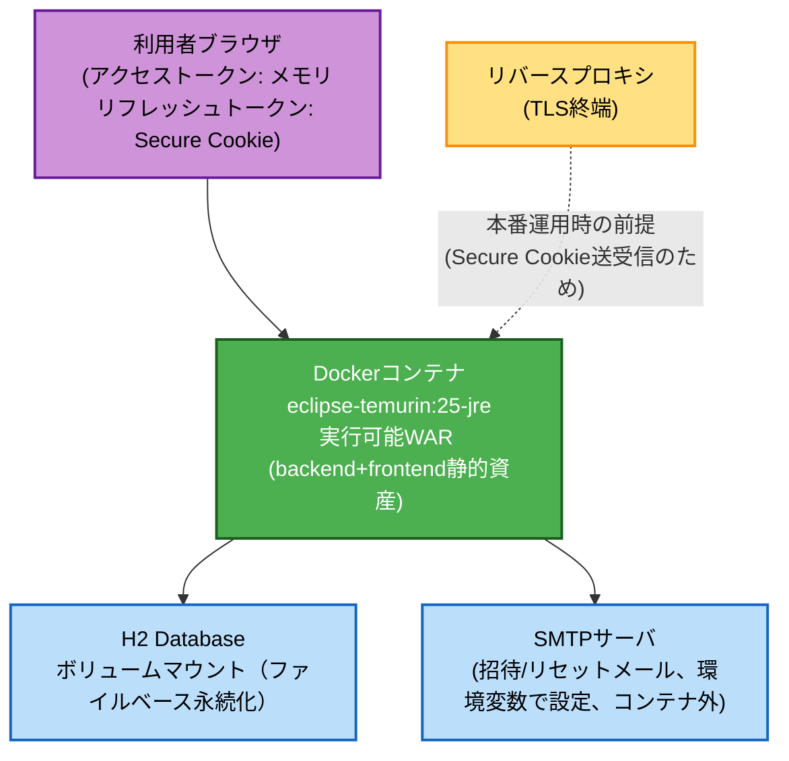

# Deployment Architecture — Unit 2: ユーザ管理

Unit 1のdeployment-architecture.mdで確定済みの構成（開発環境・本番相当コンテナ）に、
Unit 2で新たに実際に使用され始める経路（MailPit経由のメール送信、リフレッシュトークン
Cookie）を反映する。コンテナ構成・ホスト構成自体に変更はない。

## 開発環境



### テキスト代替表現
```
開発者/ユーザーのブラウザ → backend (アクセストークン: メモリ、リフレッシュトークン: Secure Cookie)
開発者 → frontend (Vite dev server) → backend (API呼び出し)
backend → H2 Database (ファイルベース、user/refresh_token/password_reset_token/audit_event)
backend → MailPit (招待メール・パスワードリセットメール送信)
```

## 本番相当（単一コンテナ）



### テキスト代替表現
```
利用者ブラウザ（アクセストークン: メモリ、リフレッシュトークン: Secure Cookie）
  → Dockerコンテナ (eclipse-temurin:25-jre、実行可能WAR)
Dockerコンテナ → H2 Database (ボリュームマウント、ファイルベース永続化)
Dockerコンテナ → SMTPサーバ (コンテナ外、環境変数で接続設定)
リバースプロキシ（TLS終端） → Dockerコンテナ （本番運用時の前提。Secure Cookieの送受信に必要）
```

**備考**: 対象RDBMS接続（Unit 3以降）はUnit 1のdeployment-architecture.mdに準じ本図では
省略。ロードバランサ・APIゲートウェイは単一インスタンス構成のため配置しない。
