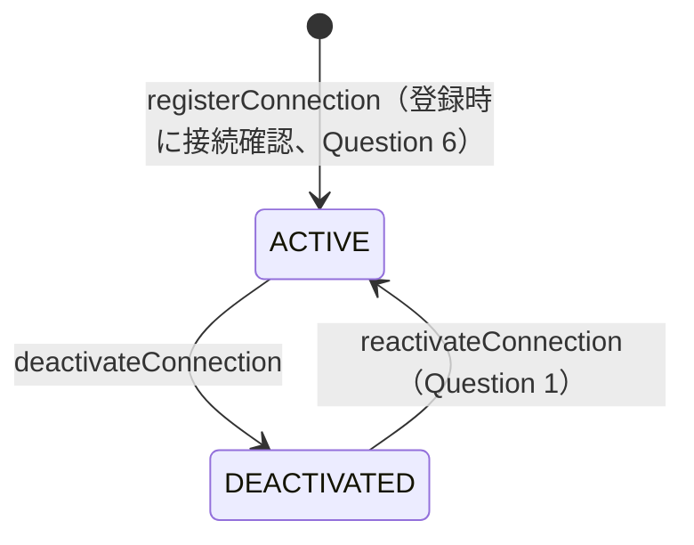
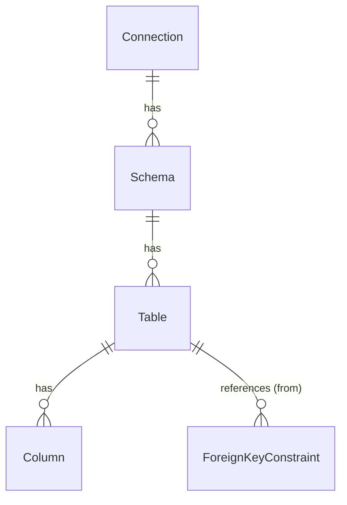

# Unit 3: 対象RDBMSセットアップ - Domain Entities

技術非依存のドメインモデル。具体的な型・永続化方式（テーブル定義等）はCode Generationで確定する。

## 1. Connection（対象RDBMS接続）

| 属性 | 説明 |
|---|---|
| id | 接続ID |
| name | 管理者が付ける表示名（一覧画面での識別用。一意制約を課す） |
| rdbmsType | RDBMS種別（MYSQL / MARIADB / POSTGRESQL / H2） |
| host | ホスト名 |
| port | ポート番号 |
| databaseName | データベース名 |
| schemaNameHint | 対象スキーマ名（Question 2追加分。任意項目。指定時はスキーマ取込を
  この1件に絞り込む。未指定時は接続ユーザが参照可能な全スキーマを自動発見する） |
| username | 接続ユーザ名 |
| encryptedPassword | 接続パスワード（可逆暗号化して保存。平文は保持しない） |
| status | 状態（ACTIVE / DEACTIVATED） |
| createdAt / updatedAt | 監査用タイムスタンプ |

### 状態遷移



### 状態遷移（テキスト代替）
```
[初期状態] --registerConnection--> ACTIVE
ACTIVE --deactivateConnection--> DEACTIVATED
DEACTIVATED --reactivateConnection--> ACTIVE
```

物理削除はない（requirements.md）。DEACTIVATED状態の接続への新規操作（スキーマ再取込等）は
拒否する。

## 2. Schema（取込済みスキーマ）

| 属性 | 説明 |
|---|---|
| id | スキーマID |
| connectionId | 所属するConnection |
| schemaName | スキーマ名（MySQL/MariaDB/H2では通常データベース名と同一） |
| importedAt | 最終取込日時 |

Question 3により、Schemaとして内部DBに存在すること自体が「許可リスト」を意味する
（別テーブルでの許可/除外管理は行わない）。

## 3. Table（取込済みテーブル/ビュー）

| 属性 | 説明 |
|---|---|
| id | テーブルID |
| schemaId | 所属するSchema |
| tableName | 物理名 |
| tableType | TABLE / VIEW |
| comment | テーブルコメント |

## 4. Column（取込済みカラム）

| 属性 | 説明 |
|---|---|
| id | カラムID |
| tableId | 所属するTable |
| columnName | 物理名 |
| ordinalPosition | 列順序 |
| dataType | データ型（JDBC型名＋精度/桁数を含む文字列表現） |
| nullable | NOT NULL制約の有無（true=NULL許容） |
| isPrimaryKey | 主キー構成列か（Question 4: PK/FK/NOT NULLのみ取込） |
| comment | カラムコメント |

## 5. ForeignKeyConstraint（外部キー制約）

| 属性 | 説明 |
|---|---|
| id | 制約ID |
| fromTableId / fromColumnName | 参照元テーブル・カラム |
| toTableId / toColumnName | 参照先テーブル・カラム |

## スキーマ取込時の全置換方針

`Table`/`Column`/`ForeignKeyConstraint`は、対象Schemaの取込（再取込含む）のたびに
全置換する（Unit4のYAMLインポートと同じ全置換方式に倣う）。置換前後の差分から
`SchemaImportResult`（追加/削除されたテーブル・カラムの一覧）を算出し、呼び出し元に返す。
削除されたテーブル・カラムの参照は、Unit 5の`MasterMaintenanceComponent#
pruneStaleCustomizations(ConnectionId, SchemaImportResult)`が消費する
（component-methods.md）。



### 関連図（テキスト代替）
```
Connection (1) --- (0..*) Schema
Schema (1) --- (0..*) Table
Table (1) --- (0..*) Column
Table (1) --- (0..*) ForeignKeyConstraint（fromTable側）
```
