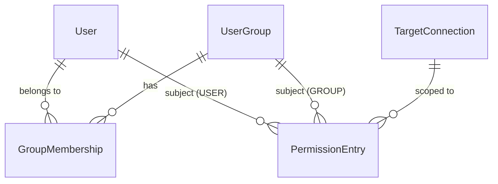

# Unit 4: アクセス制御 - Domain Entities

技術非依存のドメインモデル。具体的な型・永続化方式（テーブル定義等）はCode Generationで確定する。

## 1. UserGroup（ユーザグループ）

| 属性 | 説明 |
|---|---|
| id | グループID |
| name | グループ名（一意制約） |
| createdAt / updatedAt | 監査用タイムスタンプ |

## 2. GroupMembership（グループ所属）

| 属性 | 説明 |
|---|---|
| id | 所属ID |
| groupId | 所属先UserGroup |
| userId | 所属するUser（Unit 2の`User`） |

`(groupId, userId)`の組で一意制約を課す（同一ユーザの重複所属を防ぐ）。1人のユーザは
複数グループに同時に所属できる（US-2.4）。

## 3. Subject（値オブジェクト、非永続）

権限設定の対象（ユーザまたはグループ）を表す値オブジェクト。永続化時は各エンティティの
判別カラムとして展開される（Question 3）。

| 属性 | 説明 |
|---|---|
| subjectType | USER / GROUP |
| subjectId | `User.id`（subjectType=USERの場合）または`UserGroup.id`（GROUPの場合） |

## 4. ResourcePath（値オブジェクト、非永続）

権限設定・実効権限算出の対象リソースを表す値オブジェクト。Question 1により、
`DbSchema`/`DbTable`/`DbColumn`のIDではなく**接続ID＋名前**で対象を特定する
（スキーマ再取込による全置換でIDが変わっても権限設定が失効しないようにするため）。

| 属性 | 説明 |
|---|---|
| connectionId | 対象の`TargetConnection`（Unit 3） |
| resourceLevel | SCHEMA / TABLE / COLUMN |
| schemaName | 対象スキーマ名（全階層で必須） |
| tableName | 対象テーブル名（resourceLevel=TABLE/COLUMNの場合のみ必須、SCHEMAではnull） |
| columnName | 対象カラム名（resourceLevel=COLUMNの場合のみ必須、それ以外はnull） |

## 5. PermissionEntry（権限設定エントリ）

Subject×ResourcePathの組ごとに、主権限・補助権限の明示設定を1行で保持する
（Question 2）。

| 属性 | 説明 |
|---|---|
| id | エントリID |
| subjectType / subjectId | Subject（Question 3） |
| connectionId / resourceLevel / schemaName / tableName / columnName | ResourcePath（Question 1） |
| primaryLevel | 主権限（NONE / READ / UPDATE）。全階層（SCHEMA/TABLE/COLUMN）で設定可能 |
| auxCreate | 補助権限CREATE（真偽値）。resourceLevel=SCHEMA/TABLEでのみ意味を持つ
  （COLUMN階層の行では常にnull） |
| auxDelete | 補助権限DELETE（真偽値）。auxCreateと同様、SCHEMA/TABLEでのみ意味を持つ |
| createdAt / updatedAt | 監査用タイムスタンプ |

`(subjectType, subjectId, connectionId, resourceLevel, schemaName, tableName, columnName)`の
組で一意制約を課す（同一Subject×同一ResourcePathへの重複設定を防ぐ。Question 7の重複判定
基準と一致させる）。

## 6. EffectivePermission（実効権限、値オブジェクト・非永続）

`AccessControlComponent#resolveEffectivePermission`の戻り値。都度算出しキャッシュする
（`PermissionCacheComponent`）。

| 属性 | 説明 |
|---|---|
| primaryLevel | 実効的な主権限（NONE / READ / UPDATE） |
| canCreate | レコード作成可否（補助権限CREATE＋主キー列の実効UPDATE以上を合成した最終判定は
  business-rules.md参照） |
| canDelete | レコード削除可否（同上） |

## 関連図



### 関連図（テキスト代替）
```
User (1) --- (0..*) GroupMembership --- (0..*) (1) UserGroup
User (0..*) --- (0..*) PermissionEntry （subjectType=USER時）
UserGroup (0..*) --- (0..*) PermissionEntry （subjectType=GROUP時）
TargetConnection (1) --- (0..*) PermissionEntry （connectionId、名前ベース参照。
  DbSchema/DbTable/DbColumnへの外部キーは持たない）
```
