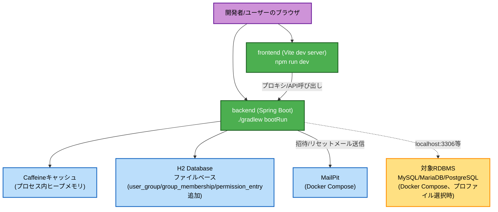
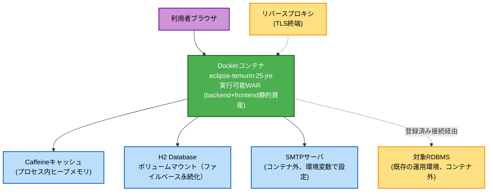

# Deployment Architecture — Unit 4: アクセス制御

Unit 1〜3のdeployment-architecture.mdで確定済みの構成に、Unit 4で追加されるプロセス内
コンポーネント（Caffeineキャッシュ）を反映する。コンテナ構成・ホスト構成自体に変更はない。

## 開発環境



### テキスト代替表現
```
開発者/ユーザーのブラウザ → backend (Spring Boot, bootRun)
開発者 → frontend (Vite dev server) → backend (API呼び出し)
backend → Caffeineキャッシュ (プロセス内ヒープメモリ、実効権限キャッシュ)
backend → H2 Database (ファイルベース、user_group/group_membership/permission_entry追加)
backend → MailPit (招待メール・パスワードリセットメール送信)
backend --(localhost:3306/3307/5432)--> 対象RDBMS (Docker Compose、プロファイル選択時)
```

## 本番相当（単一コンテナ）



### テキスト代替表現
```
利用者ブラウザ → Dockerコンテナ (eclipse-temurin:25-jre、実行可能WAR)
Dockerコンテナ → Caffeineキャッシュ (プロセス内ヒープメモリ、実効権限キャッシュ)
Dockerコンテナ → H2 Database (ボリュームマウント、ファイルベース永続化)
Dockerコンテナ → SMTPサーバ (コンテナ外、環境変数で接続設定)
Dockerコンテナ --(登録済み接続の接続情報経由)--> 対象RDBMS (コンテナ外、既存の運用環境)
リバースプロキシ（TLS終端） → Dockerコンテナ （本番運用時の前提）
```

**備考**: ロードバランサ・APIゲートウェイは単一インスタンス構成のため配置しない。
Caffeineキャッシュは単一インスタンス内で完結するため、インスタンス間でのキャッシュ同期
機構は不要（複数インスタンス化する場合はUnit 4のアーキテクチャの見直しが必要になるが、
現時点ではスコープ外）。
