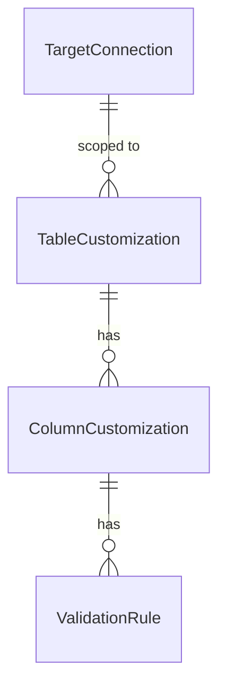

# Unit 5: データ表示 - Domain Entities

技術非依存のドメインモデル。具体的な型・永続化方式（テーブル定義等）はCode Generationで確定する。

## 1. TableCustomization（表示・入力カスタマイズ定義、テーブル単位）

Question 4により、`DbTable`のIDではなく接続ID＋スキーマ名／テーブル名の**文字列**で
対象を特定する（Unit 3/4と同じ理由）。

| 属性 | 説明 |
|---|---|
| id | 定義ID |
| connectionId | 対象の`TargetConnection`（Unit 3） |
| schemaName | 対象スキーマ名 |
| tableName | 対象テーブル名 |
| defaultSortColumn | デフォルトソート対象カラム名（任意） |
| defaultSortDirection | デフォルトソート方向（ASC/DESC、任意） |

## 2. ColumnCustomization（カラム単位のカスタマイズ）

| 属性 | 説明 |
|---|---|
| id | 定義ID |
| tableCustomizationId | 所属するTableCustomization |
| columnName | 対象カラム名 |
| displayLabel | 表示ラベル（物理カラム名に代わる論理名、任意） |
| displayOrder | 一覧での列の並び順（任意、未指定時は取込順） |
| hidden | 非表示化フラグ（true=常に非表示） |
| readOnly | 読取専用化フラグ（true=一覧・編集画面で常に読取専用） |
| inputWidget | 入力ウィジェット種別（TEXT/SELECT/CHECKBOX/DATE、Question 7） |
| selectOptions | `inputWidget=SELECT`の場合の固定値リスト（`{value, label}`の配列） |

`hidden`/`readOnly`はアクセス権限モデル（Unit 4）による制御を**上書きしない**
（requirements.md「カスタマイズ定義は権限を上書きしない」、Question 4関連）。READ権限の
ないカラムは、`hidden=false`であってもカスタマイズ定義に関わらず非表示のままとなる。

## 3. ValidationRule（簡易バリデーションルール、Question 8）

| 属性 | 説明 |
|---|---|
| id | ルールID |
| columnCustomizationId | 所属するColumnCustomization |
| type | REGEX / RANGE |
| pattern | `type=REGEX`の場合の正規表現 |
| minValue / maxValue | `type=RANGE`の場合の下限・上限（文字列表現。数値/日付は
  カラムのデータ型に応じてパースする） |

1つのColumnCustomizationに0〜複数のValidationRuleを持てる。

## 4. FilterCriteria / FilterCondition（値オブジェクト、非永続、US-3.2）

| 属性 | 説明 |
|---|---|
| conditions | `FilterCondition`のリスト（AND結合） |
| rawWhereClause | 手入力WHERE句（US-3.3、任意。指定時は`conditions`と併用しない） |

`FilterCondition`: `columnName`、`operator`（EQ/NE/LT/LE/GT/GE/LIKE/IS_NULL/IS_NOT_NULL、
Question 6）、`value`（`IS_NULL`/`IS_NOT_NULL`では不要）

## 5. SortCriteria（値オブジェクト、非永続）

| 属性 | 説明 |
|---|---|
| columnName | ソート対象カラム名 |
| direction | ASC / DESC |
| rawOrderByClause | 手入力ORDER BY句（US-3.3、任意。指定時は上記2項目と併用しない） |

## 6. RecordPage / RecordRow（値オブジェクト、非永続、`listRecords`の戻り値）

| 属性 | 説明 |
|---|---|
| columns | 表示対象カラムのメタ情報（カラム名、表示ラベル、データ型、ウィジェット種別、
  READ権限のあるカラムのみ。Unit 4の`resolveEffectivePermission`結果とUnit 5の
  カスタマイズ定義をマージした最終的な列定義） |
| rows | `RecordRow`のリスト（カラム名→値のマップ。主キー列の値も含む） |
| page / pageSize | ページ番号・1ページあたり件数（Question 9: デフォルト50件） |
| totalCount | 条件に合致する全件数 |

## 7. RecordChangeSet / RecordChange（値オブジェクト、非永続、`applyChanges`の入力、
Question 3）

| 属性 | 説明 |
|---|---|
| changes | `RecordChange`のリスト |

`RecordChange`: `operation`（CREATE/UPDATE/DELETE）、`primaryKeyValues`
（UPDATE/DELETEで対象行を特定するための主キー値マップ、CREATEでは空）、
`columnValues`（CREATE/UPDATEで設定する値のマップ）

## 8. ApplyResult / ImportResult / PruneResult（値オブジェクト、非永続）

| 型 | 属性 | 説明 |
|---|---|---|
| ApplyResult | createdCount / updatedCount / deletedCount | `applyChanges`の結果サマリ |
| ImportResult | importedTableCount | カスタマイズ定義YAMLインポートの結果 |
| PruneResult | prunedTableCount / prunedColumnCount | 陳腐化整理の結果
  （Unit 3の`SchemaImportResult`に集約される、Question 5） |

## 関連図



### 関連図（テキスト代替）
```
TargetConnection (1) --- (0..*) TableCustomization （connectionId、名前ベース参照）
TableCustomization (1) --- (0..*) ColumnCustomization
ColumnCustomization (1) --- (0..*) ValidationRule
```
