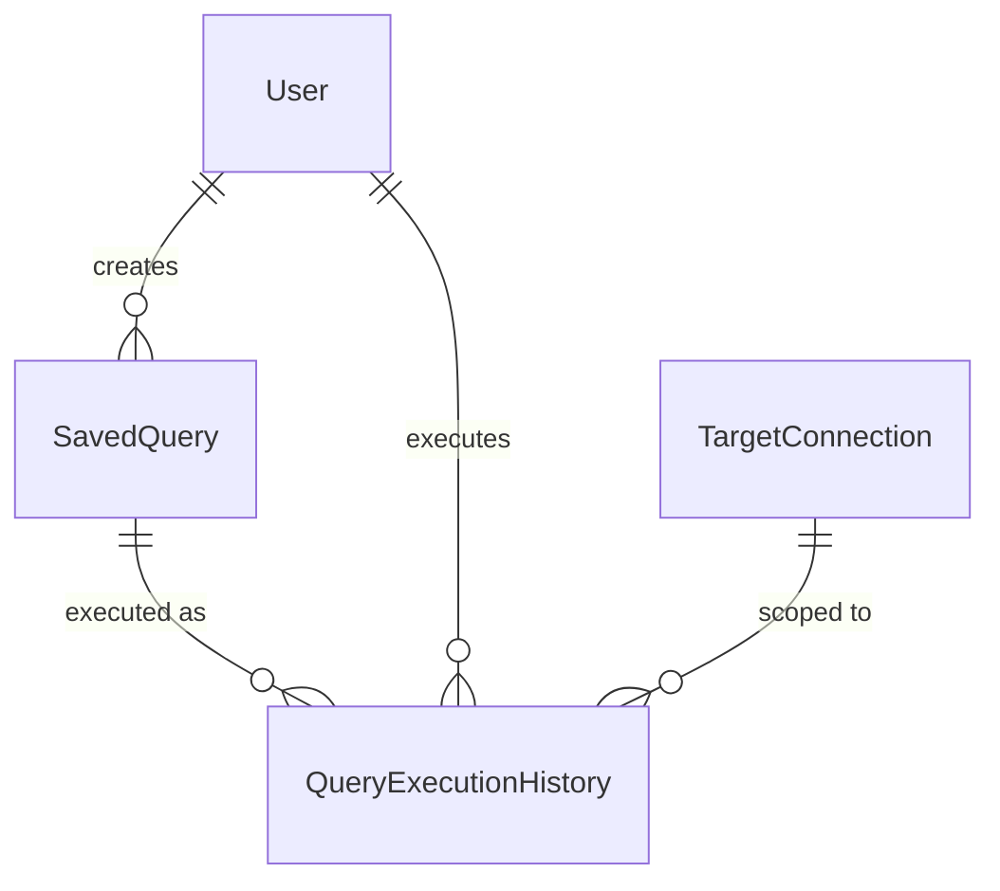

# Unit 6: その他機能 - Domain Entities

技術非依存のドメインモデル。具体的な型・永続化方式（テーブル定義等）はCode Generationで確定する。

## 1. SavedQuery（保存クエリ）

| 属性 | 説明 |
|---|---|
| id | クエリID |
| name | クエリ名 |
| sqlText | SQL本文（スキーマ非修飾） |
| visibility | 公開範囲（PUBLIC / PRIVATE） |
| creatorUserId | 作成者（Unit 2の`User`） |
| status | 状態（ACTIVE / RETIRED、論理非表示） |
| createdAt / updatedAt | 監査用タイムスタンプ |

`sqlText`はスキーマを保持しない（requirements.md、対象スキーマは実行時に指定）。
Question 5により、新規作成・既存更新のいずれも`saveQuery`が担う。

## 2. QueryExecutionHistory（クエリ実行履歴）

| 属性 | 説明 |
|---|---|
| id | 履歴ID |
| savedQueryId | 実行元の保存クエリ（任意。手入力SQLの直接実行では`null`） |
| sqlText | 実行時点のSQL本文のスナップショット（保存クエリが後で更新されても履歴は
  実行時の内容を保持する） |
| connectionId | 対象接続（Unit 3の`TargetConnection`） |
| schemaName | 実行時に指定した対象スキーマ名（Question 2関連。保存クエリ自体は
  スキーマを保持しないが、履歴は実行時のスキーマを記録する） |
| params | 実行時のパラメータ値（`:paramName`→値のマップ、Question 4） |
| resultRowCount | 結果件数 |
| executionTimeMs | 実行時間（ミリ秒） |
| executedByUserId | 実行者（Unit 2の`User`） |
| executedAt | 実行日時 |

## 3. ParameterDescriptor（値オブジェクト、非永続）

`detectParameters`の戻り値。SQL文字列から検出したパラメータ名の一覧
（`{name: String}`のリスト、Question 4）。

## 4. QueryResult（値オブジェクト、非永続）

`executeQuery`の戻り値。

| 属性 | 説明 |
|---|---|
| columns | 結果セットの列名一覧 |
| rows | 結果行（列名→値のマップのリスト） |
| rowCount | 結果件数 |
| executionTimeMs | 実行時間（ミリ秒） |

## 5. ExecutionHistoryFilterCriteria（値オブジェクト、非永続、US-4.6）

`executedByUserId`（実行者）、`connectionId`（対象接続）、`schemaName`（対象スキーマ）、
`sqlTextContains`（SQLテキストの部分一致）、`fromDate`/`toDate`（実行日時の期間）。
いずれも`QueryExecutionHistory`の実カラムに対するフィルタであり、追加の技術的考慮は
不要（Unit 6独自のエンティティであり、Unit 2の`AuditEvent`のようなJSON詳細カラム問題は
発生しない）。

## 6. AuditEventFilterCriteria（値オブジェクト、非永続、US-5.1）

Question 7により、`AuditEvent`の実カラムのみを対象とする: `eventType`、
`actorUserId`、`fromDate`/`toDate`（`occurredAt`の期間）。`details`（JSON）内の
接続ID・対象リソース等はフィルタ対象外とし、一覧の各行の詳細表示でのみ確認できる。

## QueryBuilderState（フロントエンドのみ、非永続、Question 1）

タブ構成（SELECT/FROM/JOIN/WHERE/GROUP BY/HAVING/ORDER BY/LIMIT OFFSET）に対応する
構造化状態。`buildSql`/`parseSqlToBuilderState`はフロントエンド（TypeScript）に
実装するため、バックエンドのドメインモデルには含まれない。バックエンドは常に
`sqlText`（文字列）としてのみSQLを扱う。

## 関連図



### 関連図（テキスト代替）
```
User (1) --- (0..*) SavedQuery （creatorUserId）
SavedQuery (1) --- (0..*) QueryExecutionHistory （savedQueryId、任意）
User (1) --- (0..*) QueryExecutionHistory （executedByUserId）
TargetConnection (1) --- (0..*) QueryExecutionHistory （connectionId）
```
