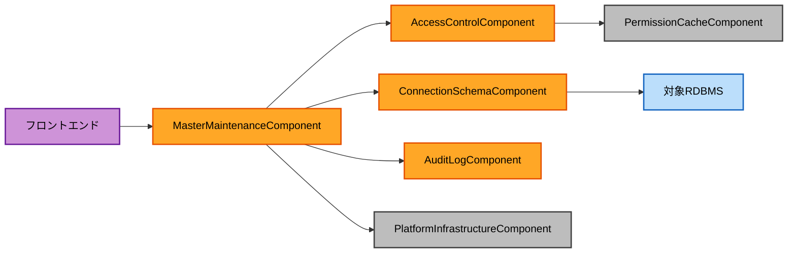

# Component Dependency (MasterMeister5)

## 依存関係マトリクス

`○` = 直接依存（呼び出す）、`—` = 依存なし

| 依存元 \ 依存先 | UserAccount | ConnSchema | AccessControl | MasterMaint | Query | AuditLog | SecurityInfra | PermCache | PlatformInfra | Notification |
|---|---|---|---|---|---|---|---|---|---|---|
| UserAccountComponent | — | — | — | — | — | ○ | ○ | — | ○ | ○ |
| ConnectionSchemaComponent | — | — | — | — | — | ○ | ○ | ○(無効化トリガー) | ○ | — |
| AccessControlComponent | — | ○(スキーマ参照) | — | — | — | ○ | — | ○ | ○ | — |
| MasterMaintenanceComponent | — | ○ | ○ | — | — | ○ | — | — | ○ | — |
| QueryComponent | — | ○(許可リスト検証) | — | — | — | ○ | — | — | ○ | — |
| AuditLogComponent | — | — | — | — | — | — | — | — | ○(i18n) | — |
| SecurityInfrastructureComponent | — | — | — | — | — | — | — | — | — | — |
| PermissionCacheComponent | — | — | — | — | — | — | — | — | — | — |
| PlatformInfrastructureComponent | — | — | — | — | — | — | — | — | — | — |
| NotificationComponent | — | — | — | — | — | — | — | — | ○(i18n) | — |

**観察**:
- 基盤コンポーネント（SecurityInfrastructure、PermissionCache、PlatformInfrastructure、
  Notification）はドメインコンポーネントへ依存しない（リーフノード）。循環依存は存在しない
- ドメインコンポーネント間の直接依存は、AccessControl→ConnectionSchema（スキーマ構造参照）、
  MasterMaintenance→ConnectionSchema・AccessControl、Query→ConnectionSchemaの3方向のみ。
  UserAccount・AuditLogは他ドメインコンポーネントに依存しない

## 通信パターン

- すべてのコンポーネント間呼び出しは同一プロセス内（単一WARデプロイ）の同期メソッド呼び出しを
  基本とする。メッセージキュー等の非同期通信は本プロジェクトのスコープでは使用しない
- `AuditLogComponent.recordEvent`は各サービス（services.md）のユースケース完了時に同期的に
  呼び出す（監査ログの記録漏れを防ぐため、業務トランザクションと同一トランザクション内で
  確定させることをFunctional Designで検討する）
- `PermissionCacheComponent`は`AccessControlComponent`からの参照（読み取り）と、
  `AccessControlComponent`／`ConnectionSchemaComponent`からの無効化呼び出し（書き込み）の
  両方を受け付ける

## データフロー図（代表例: マスタデータ一括反映）



### テキスト代替表現
```
フロントエンド → MasterMaintenanceComponent
MasterMaintenanceComponent → AccessControlComponent → PermissionCacheComponent（権限確認）
MasterMaintenanceComponent → ConnectionSchemaComponent → 対象RDBMS（データ読み書き）
MasterMaintenanceComponent → AuditLogComponent（操作記録）
MasterMaintenanceComponent → PlatformInfrastructureComponent（ログ出力）
```
