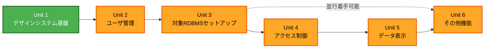

# Unit of Work Dependency (MasterMeister5)

## 依存関係マトリクス

`○` = 直接依存（先に完了している必要がある）、`—` = 依存なし

| 依存元 \ 依存先 | Unit 1 | Unit 2 | Unit 3 | Unit 4 | Unit 5 | Unit 6 |
|---|---|---|---|---|---|---|
| Unit 1 デザインシステム基盤 | — | — | — | — | — | — |
| Unit 2 ユーザ管理 | ○ | — | — | — | — | — |
| Unit 3 対象RDBMSセットアップ | ○ | ○ | — | — | — | — |
| Unit 4 アクセス制御 | ○ | ○ | ○ | — | — | — |
| Unit 5 データ表示 | ○ | ○ | ○ | ○ | — | — |
| Unit 6 その他機能 | ○ | ○ | ○ | — | — | — |

**依存理由**:
- Unit 2 → Unit 1: AppShell・テーマ・構造化ログ/i18n基盤の上に画面・APIを構築するため
- Unit 3 → Unit 2: 接続パスワードの暗号化（SecurityInfrastructureComponent）、接続関連の
  監査ログ記録（AuditLogComponent）を利用するため
- Unit 4 → Unit 3: アクセス権限をスキーマ／テーブル／カラムに対して設定するため、
  ConnectionSchemaComponentが保持するスキーマ情報を参照する
- Unit 5 → Unit 3, Unit 4: マスタメンテナンスはスキーマ情報（Unit 3）とアクセス権限判定
  （Unit 4）の両方に依存する
- Unit 6 → Unit 3: クエリ実行時の対象スキーマ許可リスト検証にConnectionSchemaComponentを
  利用する。Unit 6 → Unit 2: 監査ログ閲覧APIはUnit 2で構築したAuditLogComponentの記録機構を
  前提とする。Unit 6はUnit 4・Unit 5の完了を必須としない（並行着手も可能だが、
  00-project-overview.mdの優先順位により最後に着手する）

## 開発順序（Per-Unit Loop適用順）



### テキスト代替表現
```
Unit 1（デザインシステム基盤）
  → Unit 2（ユーザ管理）
    → Unit 3（対象RDBMSセットアップ）
      → Unit 4（アクセス制御）
        → Unit 5（データ表示）
          → Unit 6（その他機能。Unit 3完了後に並行着手も可能だが、
                     00-project-overview.mdの優先順位により最後に実施）
```

**採用する更新戦略**: Sequential（00-project-overview.mdが明示する優先順位に従い、単独開発者が
Unit 1から順に完全に完了させてから次のUnitへ進む。CLAUDE.mdのPer-Unit Loopの原則と整合）

## 循環依存の検証

上記マトリクスは下三角のみに依存があり、循環依存は存在しない。
