# Execution Plan (MasterMeister5)

## Detailed Analysis Summary

### プロジェクト種別
Greenfield（既存コードなし）。`reference/aidlc-requirements-input/` の詳細インプットに基づき、
Requirements Analysis・User Storiesを実施済み。

### Change Impact Assessment
- **User-facing changes**: Yes — アプリケーション全体がエンドユーザー（管理者・一般ユーザ）
  向けの新規Webアプリケーションである
- **Structural changes**: Yes — Gradleマルチモジュール構成（backend/frontend/libs）を
  新規に構築する
- **Data model changes**: Yes — 内部DB（ユーザ、接続設定、取込スキーマ、グループ、権限設定、
  カスタマイズ定義、保存クエリ、クエリ実行履歴、監査ログ、ユーザ別UI設定等）を新規設計する
- **API changes**: Yes — REST APIを新規に設計・実装する（OpenAPI仕様自動生成を含む）
- **NFR impact**: Yes — security-baseline拡張（SECURITY-01〜15）とproperty-based-testing
  拡張を全面適用する。resiliency-baseline拡張は適用しない

### Risk Assessment
- **Risk Level**: Medium
  （根拠: greenfieldのため本番環境への影響・ロールバックの複雑さは低いが、多階層権限の合成
  ロジック・YAML入出力の全置換方式・SQL動的生成等、業務ロジックの複雑度が高く、要件確認の
  過程で一部項目（無効化ユーザの既存セッション扱い等）をFunctional Design以降に留保している）
- **Rollback Complexity**: Easy（未リリースのため、実装済みコードの破棄・作り直しで対応可能）
- **Testing Complexity**: Complex（権限判定・合成ロジック、YAML入出力、SQL生成ロジックに
  property-based-testing拡張を全面適用するなど、テスト設計自体の複雑度が高い）

## Workflow Visualization

```mermaid
flowchart TD
    Start(["User Request"])

    subgraph INCEPTION["INCEPTION PHASE"]
        WD["Workspace Detection<br/>COMPLETED"]
        RA["Requirements Analysis<br/>COMPLETED"]
        US["User Stories<br/>COMPLETED"]
        WP["Workflow Planning<br/>IN PROGRESS"]
        AD["Application Design<br/>EXECUTE"]
        UG["Units Generation<br/>EXECUTE"]
    end

    subgraph CONSTRUCTION["CONSTRUCTION PHASE"]
        FD["Functional Design<br/>EXECUTE per unit"]
        NFRA["NFR Requirements<br/>EXECUTE per unit"]
        NFRD["NFR Design<br/>EXECUTE per unit"]
        ID["Infrastructure Design<br/>EXECUTE per unit"]
        CG["Code Generation<br/>EXECUTE"]
        BT["Build and Test<br/>EXECUTE"]
    end

    subgraph OPERATIONS["OPERATIONS PHASE"]
        OPS["Operations<br/>PLACEHOLDER"]
    end

    Start --> WD
    WD --> RA
    RA --> US
    US --> WP
    WP --> AD
    AD --> UG
    UG --> FD
    FD --> NFRA
    NFRA --> NFRD
    NFRD --> ID
    ID --> CG
    CG -.->|Next Unit| FD
    CG --> BT
    BT -.-> OPS
    BT --> End(["Complete"])

    style WD fill:#4CAF50,stroke:#1B5E20,stroke-width:3px,color:#fff
    style RA fill:#4CAF50,stroke:#1B5E20,stroke-width:3px,color:#fff
    style US fill:#4CAF50,stroke:#1B5E20,stroke-width:3px,color:#fff
    style WP fill:#4CAF50,stroke:#1B5E20,stroke-width:3px,color:#fff
    style AD fill:#FFA726,stroke:#E65100,stroke-width:3px,stroke-dasharray: 5 5,color:#000
    style UG fill:#FFA726,stroke:#E65100,stroke-width:3px,stroke-dasharray: 5 5,color:#000
    style FD fill:#FFA726,stroke:#E65100,stroke-width:3px,stroke-dasharray: 5 5,color:#000
    style NFRA fill:#FFA726,stroke:#E65100,stroke-width:3px,stroke-dasharray: 5 5,color:#000
    style NFRD fill:#FFA726,stroke:#E65100,stroke-width:3px,stroke-dasharray: 5 5,color:#000
    style ID fill:#FFA726,stroke:#E65100,stroke-width:3px,stroke-dasharray: 5 5,color:#000
    style CG fill:#4CAF50,stroke:#1B5E20,stroke-width:3px,color:#fff
    style BT fill:#4CAF50,stroke:#1B5E20,stroke-width:3px,color:#fff
    style OPS fill:#BDBDBD,stroke:#424242,stroke-width:2px,stroke-dasharray: 5 5,color:#000
    style INCEPTION fill:#BBDEFB,stroke:#1565C0,stroke-width:3px,color:#000
    style CONSTRUCTION fill:#C8E6C9,stroke:#2E7D32,stroke-width:3px,color:#000
    style OPERATIONS fill:#FFF59D,stroke:#F57F17,stroke-width:3px,color:#000
    style Start fill:#CE93D8,stroke:#6A1B9A,stroke-width:3px,color:#000
    style End fill:#CE93D8,stroke:#6A1B9A,stroke-width:3px,color:#000

    linkStyle default stroke:#333,stroke-width:2px
```



### テキスト代替表現
```
INCEPTION PHASE
- Workspace Detection: COMPLETED
- Requirements Analysis: COMPLETED
- User Stories: COMPLETED
- Workflow Planning: IN PROGRESS
- Application Design: EXECUTE
- Units Generation: EXECUTE

CONSTRUCTION PHASE（ユニットごとに繰り返し）
- Functional Design: EXECUTE（ユニットごとに要否再判定）
- NFR Requirements: EXECUTE（ユニットごとに要否再判定）
- NFR Design: EXECUTE（ユニットごとに要否再判定）
- Infrastructure Design: EXECUTE（ユニットごとに要否再判定）
- Code Generation: EXECUTE（常時）
- Build and Test: EXECUTE（常時、全ユニット完了後）

OPERATIONS PHASE
- Operations: PLACEHOLDER
```

## Phases to Execute

### 🔵 INCEPTION PHASE
- [x] Workspace Detection (COMPLETED)
- [x] Requirements Analysis (COMPLETED)
- [x] User Stories (COMPLETED)
- [x] Workflow Planning (IN PROGRESS)
- [ ] Application Design - **EXECUTE**
  - **Rationale**: 認証・RBAC（権限合成）・スキーマ取込・クエリビルダー・YAML入出力・
    監査ログ・メール送信・UIデザインシステム基盤など、新規に定義すべきコンポーネント/
    サービスが多数存在し、それぞれの責務境界とメソッド、コンポーネント間依存関係を
    Units Generationの前に明確化する価値が大きい
- [ ] Units Generation - **EXECUTE**
  - **Rationale**: 00-project-overview.mdで明示された優先順位（デザインシステム基盤 →
    ユーザ管理 → 対象RDBMSセットアップ → アクセス制御 → データ表示 → その他機能）に沿って
    複数ユニットに分割することで、段階的なMVP開発と手戻りの最小化ができる。バックエンド
    （マルチモジュール）・フロントエンドという複数パッケージにまたがる変更でもある

### 🟢 CONSTRUCTION PHASE
（各ユニットのPer-Unit Loopで最終的な実行要否を再判定する。以下は現時点での全体方針）

- [ ] Functional Design - **EXECUTE（ユニットごとに再判定）**
  - **Rationale**: 権限合成ロジック、YAML入出力の全置換方式、SQL動的生成、スキーマ再取込時の
    カスタマイズ定義自動削除など、詳細設計が必要な複雑な業務ロジックを持つユニットが多い
- [ ] NFR Requirements - **EXECUTE（ユニットごとに再判定）**
  - **Rationale**: security-baseline拡張の全面適用、property-based-testing拡張の対象
    ロジック特定（権限判定・合成ロジック、YAML入出力、SQL生成ロジック）をユニットごとに
    確認する必要がある
- [ ] NFR Design - **EXECUTE（ユニットごとに再判定）**
  - **Rationale**: JWT認証・トークン管理、HTTPセキュリティヘッダ、レート制限等の
    セキュリティパターンをユニットごとに組み込む必要がある
- [ ] Infrastructure Design - **EXECUTE（ユニットごとに再判定、軽量）**
  - **Rationale**: クラウドインフラは対象外（自己完結WAR・Dockerコンテナ化）だが、
    devenv（Docker Compose: MailPit、DBコンテナ）やビルド成果物の配置（frontend→backend
    静的リソース）等、実サービスへのマッピングは必要
- [x] Code Generation - EXECUTE (ALWAYS)
  - **Rationale**: 実装計画立案とコード生成が必要
- [x] Build and Test - EXECUTE (ALWAYS)
  - **Rationale**: ビルド・テスト・検証が必要

### 🟡 OPERATIONS PHASE
- [ ] Operations - PLACEHOLDER
  - **Rationale**: 将来のデプロイ・監視ワークフロー用のプレースホルダー
    （CI/CD構築自体は開発最終段階でスコープに含まれるが、Operations固有の内容は本ワークフロー
    では未定義）

## Estimated Timeline
- **Total Phases**: 8（Application Design、Units Generation、Per-Unitループ×N（Functional
  Design/NFR Requirements/NFR Design/Infrastructure Design/Code Generation）、Build and Test）
- **Estimated Duration**: ユニット数・粒度はUnits Generationステージで確定するため、
  現時点では見積もらない（00-project-overview.mdの優先順位に沿った段階的開発を想定）

## Success Criteria
- **Primary Goal**: requirements.md・stories.mdに基づくMasterMeister5の実装（デザインシステム
  基盤 → ユーザ管理 → 対象RDBMSセットアップ → アクセス制御 → データ表示 → その他機能の順）
- **Key Deliverables**: Application Design成果物、Units一覧、各ユニットの設計・実装・テスト、
  ビルド・テスト手順書
- **Quality Gates**: security-baseline拡張（SECURITY-01〜15）・property-based-testing拡張の
  コンプライアンス確認を各ステージで実施し、blocking findingは解消してから次ステージへ進む
